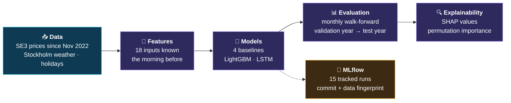
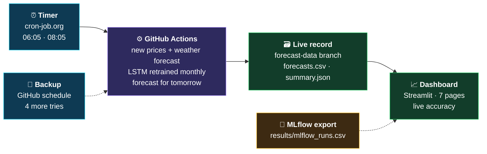
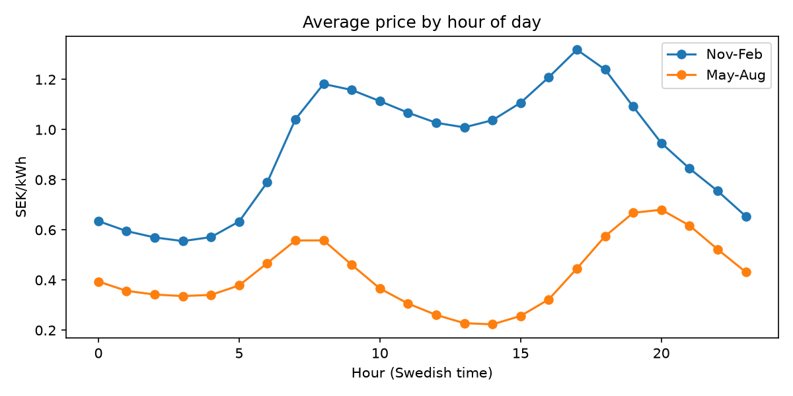
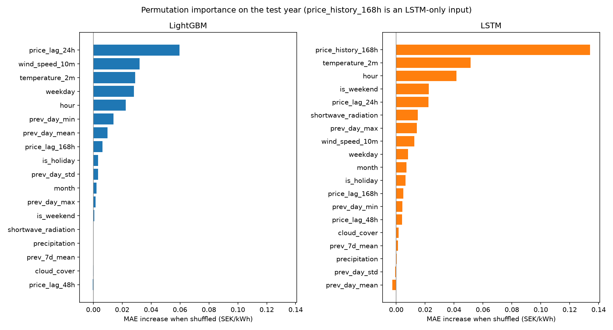

# ⚡ SE3 Electricity Price Forecast

**An end-to-end machine learning system that forecasts tomorrow's 24 hourly electricity prices in Sweden's SE3 price zone (Stockholm region), every morning, before the day-ahead prices are published.**

[](https://github.com/Hossain007Bhuiyan/se3-electricity-forecast/actions/workflows/tests.yml)
[](https://github.com/Hossain007Bhuiyan/se3-electricity-forecast/actions/workflows/daily_forecast.yml)
[](https://se3-electricity-forecast.streamlit.app/)

[](https://www.python.org/)
[](https://pytorch.org/)
[](https://lightgbm.readthedocs.io/)
[](https://mlflow.org/)
[](https://streamlit.io/)
[](https://docs.astral.sh/uv/)

**[🌐 Open the live dashboard](https://se3-electricity-forecast.streamlit.app/)** · **[📈 See the live forecast record](https://github.com/Hossain007Bhuiyan/se3-electricity-forecast/tree/forecast-data)**

---

## 📖 What Is This Project?

Every day, the electricity prices for the next day are set in an auction that closes at 12:00 Swedish time and are published around 13:00. This project forecasts all 24 hourly prices for SE3 **before that deadline**, and does so automatically every morning.

- **Data:** hourly SE3 prices since November 2022, Stockholm weather and Swedish holidays.
- **Models:** four simple baselines, LightGBM and an LSTM neural network (PyTorch), all evaluated in exactly the same way.
- **Result:** on a full year of unseen test data (October 2025 to September 2026), the LSTM's average error is **34% lower** than the best simple baseline, and it beat LightGBM in **11 of 12 months**.
- **Explainability:** SHAP values and permutation importance show what drives each model's forecasts.
- **Live system:** the forecast runs every morning; every forecast is saved and later compared with the real prices.
- **Engineering:** experiment tracking with MLflow, 59 automated tests, continuous integration with GitHub Actions and a public dashboard.

---

## 🖥️ Live Dashboard

**[se3-electricity-forecast.streamlit.app](https://se3-electricity-forecast.streamlit.app/)** reads the live record and the results directly from GitHub, so it updates by itself. A menu at the top leads to seven pages:

| Menu | Page | What it shows |
|---|---|---|
| Forecast | Tomorrow's forecast | the key numbers and all 24 hours, with the real prices once published |
| Forecast | Live accuracy | the error of every counted day, and any earlier day in detail |
| Forecast | Price landscape (3D) | the real prices of the last 30 days as a rotatable 3D surface |
| Model | Test-year results | all six models on the test year |
| Model | Experiment tracking (MLflow) | every tracked run, with a link to its exact code commit |
| Project | How it works | the four daily steps |
| Project | Data and sources | where the data comes from, the rules behind every number, and the live CI status |

On phones, a **Menu** button and a row of page buttons replace the top menu, and the charts scroll with the page instead of zooming. The dashboard is hosted for free on Streamlit Community Cloud. After 12 hours without visitors it goes to sleep; the button "Yes, get this app back up!" starts it again within about a minute.

---

## 📊 Results

All models were evaluated with **monthly walk-forward validation**: for every month, the model is trained on all data before that month and then forecasts the month, exactly as in real use. The error is the **MAE** (mean absolute error) in SEK/kWh; **rel_mae** compares each model with the `weekly_naive` baseline (below 1 is better).

**Test year** (1 October 2025 to 26 September 2026, 8,664 hours, used only for the final evaluation):

| Model | MAE (SEK/kWh) | RMSE | rel_mae |
|---|---:|---:|---:|
| **LSTM** | **0.2089** | **0.2974** | **0.66** |
| LightGBM | 0.2366 | 0.3282 | 0.75 |
| Baseline: weekly_naive | 0.3162 | 0.4397 | 1.00 |
| Baseline: same hour yesterday | 0.3170 | 0.4448 | 1.00 |
| Baseline: yesterday's average | 0.3442 | 0.4588 | 1.09 |
| Baseline: same hour last week | 0.3983 | 0.5497 | 1.26 |

- The LSTM had the lowest error in 11 of the 12 test months (LightGBM was better in April 2026).
- A Diebold-Mariano test on the daily errors (with a Newey-West correction for 7 days) gives a statistic of **−5.82**: the LSTM's advantage over LightGBM is clearly significant.
- All model choices were made on the **validation year** (October 2024 to September 2025), where the LSTM also had the lowest error (MAE 0.1989, rel_mae 0.67), ahead of the best of four LightGBM versions (0.2143, rel_mae 0.72).

**Live results:** real forecasts have been made every morning since October 2026. Their accuracy, counting only forecasts made before the 12:00 deadline, is on the [dashboard](https://se3-electricity-forecast.streamlit.app/) and in [`summary.json`](https://github.com/Hossain007Bhuiyan/se3-electricity-forecast/blob/forecast-data/summary.json). A few weeks of live data are needed before they can be compared fairly with the test year.

---

## 🏗️ How It Works

The project has three parts: a **research pipeline** that built and evaluated the models, a **daily production run** that forecasts every morning, and **continuous integration** that tests every change.

**1. Research pipeline:** from raw data to a validated, explained model



**2. Daily production run:** every morning, before the 12:00 deadline



**3. Continuous integration:** on every push and pull request


In more detail:

1. **Data.** SE3 day-ahead prices from [elprisetjustnu.se](https://www.elprisetjustnu.se) (since October 2025 they are published per 15 minutes and averaged per hour) and Stockholm weather from [Open-Meteo](https://open-meteo.com).
2. **Features.** 18 inputs, all known on the morning before the forecast day: hour, weekday, month, weekend, Swedish holidays (including Midsommarafton, Julafton and Nyårsafton), prices from 1, 2 and 7 days before, yesterday's average, minimum, maximum and spread, the average of the last 7 days, and five weather variables.
3. **Models.** Four baselines (simple rules such as "same hour yesterday"); LightGBM in four versions (predicting the price or the change from yesterday, each with two loss functions) with fixed, untuned settings; and an LSTM that reads the last 168 hourly prices (7 days) and combines them with the other inputs in a small neural network.
4. **Evaluation.** Monthly walk-forward validation on the validation year, then one final evaluation on the test year.
5. **Explainability.** SHAP values (TreeSHAP for LightGBM, expected gradients with Captum for the LSTM) and permutation importance on the test year.
6. **Tracking, tests and CI.** Every run is tracked with MLflow; continuous integration with GitHub Actions runs all automated tests on every push.
7. **Live system.** Every morning, a timer starts the GitHub Actions workflow, which forecasts tomorrow and saves the result in the `forecast-data` branch, which the dashboard reads.

---

## 🔍 Data Exploration

The exploration notebooks ([`notebooks`](notebooks)) show the patterns the models have to learn:

- **Two daily peaks:** prices rise in the morning (around 08:00) and peak in the late afternoon and evening; nights are cheapest.
- **Seasons:** winter prices (November to February) are about twice as high as summer prices (May to August). In summer, prices also drop around midday, when solar power is highest.
- **Weekends:** Saturdays and Sundays are almost 40% cheaper on average than weekdays.



---

## 🛡️ Keeping the Evaluation Honest

Forecasting results can easily look better than they really are. These rules prevent that:

- **No information from the future.** Every input is known on the morning before the forecast day. Automated tests check this for every feature, including the 23- and 25-hour days when the clocks change.
- **Weather forecasts, not measured weather.** The models are trained on measured weather, but the validation, test and live forecasts use weather *forecasts* (for validation and test: archived forecasts made two days earlier), because tomorrow's real weather is never known in advance.
- **A separate test year.** All decisions were made on the validation year. The test year was used only for the final evaluation.
- **The 12:00 deadline in live use.** Only forecasts made before 12:00 Swedish time on the day before count in the live accuracy. Later forecasts are shown but not counted.
- **Traceable results.** Every run records its code version and a fingerprint of its data.

---

## 🧠 What Drives the Forecasts

- The most important information is the price development over the last week, yesterday's price at the same hour, the temperature and the time of day.
- Cold weather, high recent prices and the morning and evening hours raise the forecast. Wind, sunshine, weekends and holidays lower it.
- Extreme price spikes remain the hardest part. For the most expensive hour of the test year (19 February 2026 at 08:00, 4.90 SEK/kWh), the LSTM forecast 1.75 SEK/kWh: it recognised the hour as expensive but predicted less than half of the actual price.



SHAP values show how a model uses its inputs, not proven causes. Inputs that carry similar information, such as yesterday's price and the price history of the last week, share their importance. The SHAP charts explain a version of each model trained once before the test year, so their forecasts can differ slightly from the monthly retrained models (for the hour above: 1.78 instead of 1.75 SEK/kWh). All charts are in the [`figures`](figures) folder.

---

## 🧪 Experiment Tracking, Tests and CI

**MLflow.** All 15 runs (the baselines, four LightGBM versions and the LSTM on the validation year; the baselines, LightGBM and the LSTM on the test year) are tracked with their settings, results, monthly errors, hourly predictions, Git commit and data fingerprint. The MLflow database is stored locally; an export of all runs is in [`results/mlflow_runs.csv`](results/mlflow_runs.csv) and on the dashboard's **Experiment tracking** page.


**Tests.** 59 automated tests (pytest: 46 main tests and 13 PyTorch tests) check that no feature uses future information, the time-based split, the clock changes, Swedish holidays, the weather forecasts, MLflow tracking, repeatable model training, the daily forecast program and every page of the dashboard. They use small synthetic data, so no downloaded data is needed.

**Continuous integration (CI).** On every push to `main` and on every pull request, [GitHub Actions](https://github.com/Hossain007Bhuiyan/se3-electricity-forecast/actions/workflows/tests.yml) runs the whole test suite on a clean Linux machine:

1. installs the exact package versions from `uv.lock` (`uv sync --locked` stops if the lock file does not match `pyproject.toml`);
2. runs the main tests;
3. runs the PyTorch tests in a separate process, because LightGBM and PyTorch must not share a process.

The **tests** badge at the top shows the result of the latest run. A second workflow, **daily forecast**, runs the live forecast every morning (see below).

---

## ⚙️ The Live System

| | Details |
|---|---|
| **When** | An external timer ([cron-job.org](https://cron-job.org)) starts the forecast at 06:05 and 08:05 Swedish time. GitHub's own schedule runs four more times each morning as a backup, because GitHub can delay or skip scheduled runs. The first forecast made counts; later runs do not change it. |
| **What** | The workflow downloads the newest prices and a weather forecast, retrains the LSTM at the start of each month, forecasts tomorrow's 24 hours with the LSTM and the `weekly_naive` baseline, and fills in the real prices of earlier forecasts. |
| **Where** | The [`forecast-data`](https://github.com/Hossain007Bhuiyan/se3-electricity-forecast/tree/forecast-data) branch: `forecasts.csv` (every forecast hour with the real price) and `summary.json` (the live accuracy). |

---

## 🛠️ Tech Stack

| Area | Tools |
|---|---|
| Language and packages | Python 3.12, uv (exact versions in `uv.lock`) |
| Data | pandas, NumPy, PyArrow, requests, holidays |
| Models | LightGBM, PyTorch (LSTM), scikit-learn |
| Explainability | LightGBM TreeSHAP, Captum (expected gradients), matplotlib |
| Experiment tracking | MLflow |
| Testing and automation | pytest, GitHub Actions, cron-job.org |
| Dashboard | Streamlit, Plotly, Streamlit Community Cloud |
| Data sources | elprisetjustnu.se (prices), Open-Meteo (weather) |

---

## ⚠️ Limitations

- **Price spikes are underestimated.** The models learn typical patterns and react too little to rare, extreme hours.
- **Inputs are limited.** The models know prices, the calendar and the weather in one place (Stockholm). They do not know hydro reservoir levels, nuclear plant availability, cross-border transmission or fuel prices, which also drive Nordic prices.
- **Training and forecasting use different weather.** Training uses measured weather, forecasting uses weather forecasts, so errors in the weather forecast carry over into the price forecast.
- **The live record is still short.** It started in October 2026, so live accuracy becomes meaningful only after several weeks.
- **Spot prices only.** All prices are the market price before VAT, taxes, network fees and supplier charges.
- **Free services.** GitHub Actions, cron-job.org and Streamlit Community Cloud are used on free tiers, without availability guarantees.

---

## 🚀 Run It Yourself

Requirements: [uv](https://docs.astral.sh/uv/), which installs Python 3.12 and all packages in the exact versions of `uv.lock`. On macOS, LightGBM also needs OpenMP: `brew install libomp`.

```bash
git clone https://github.com/Hossain007Bhuiyan/se3-electricity-forecast.git
cd se3-electricity-forecast
uv sync
```

Reproduce the results, one command after the other. LightGBM and PyTorch run in separate commands, because they must not share a process on macOS.

```bash
uv run python -m se3_electricity_forecast.data_download
uv run python -m se3_electricity_forecast.features
uv run python -m se3_electricity_forecast.weather_forecast
uv run python -m se3_electricity_forecast.baselines
uv run python -m se3_electricity_forecast.train_lgbm
uv run python -m se3_electricity_forecast.train_lstm
uv run python -m se3_electricity_forecast.final_test lgbm
uv run python -m se3_electricity_forecast.final_test lstm
uv run python -m se3_electricity_forecast.final_test report
uv run python -m se3_electricity_forecast.explain lgbm
uv run python -m se3_electricity_forecast.explain lstm
uv run python -m se3_electricity_forecast.explain report
```

The results above were produced with the data fingerprint recorded in MLflow. If a data source later corrects past values, a fresh download can give slightly different numbers; comparing the fingerprints shows whether the data is identical.

Other commands:

```bash
uv run pytest                                                          # main tests
uv run pytest tests_torch                                              # PyTorch tests
uv run python -m se3_electricity_forecast.daily                        # one live forecast, saved locally
uv run streamlit run dashboard/app.py                                  # the dashboard on your computer
uv run mlflow ui --backend-store-uri sqlite:///mlflow.db --port 5001   # the MLflow interface
uv run python -m se3_electricity_forecast.tracking                     # export MLflow runs for the dashboard
```

---

## 🗂️ Project Structure

```
se3-electricity-forecast/
├── src/se3_electricity_forecast/
│   ├── data_download.py      download prices and weather
│   ├── features.py           the 18 inputs
│   ├── weather_forecast.py   archived weather forecasts for validation and test
│   ├── evaluate.py           time-based split and error measures
│   ├── baselines.py          four simple rules
│   ├── train_lgbm.py         LightGBM, monthly walk-forward
│   ├── train_lstm.py         LSTM, monthly walk-forward
│   ├── final_test.py         final evaluation on the test year
│   ├── explain.py            SHAP values and permutation importance
│   ├── tracking.py           MLflow tracking and export
│   └── daily.py              the daily live forecast
├── dashboard/                Streamlit app (app.py, views.py, live_data.py)
├── tests/                    main tests
├── tests_torch/              PyTorch tests
├── notebooks/                data exploration
├── results/                  result tables and the MLflow export
├── figures/                  charts
└── .github/workflows/        tests and daily forecast
```

---

## 💡 Skills Demonstrated

- **Time-series forecasting:** feature engineering without leakage, walk-forward validation, baselines, statistical comparison of models.
- **Machine learning and deep learning:** gradient boosting (LightGBM) and recurrent neural networks (PyTorch LSTM).
- **Explainable AI:** SHAP values and permutation importance for both models.
- **MLOps:** experiment tracking (MLflow), reproducible environments (uv), automated testing and CI (pytest, GitHub Actions), scheduled production forecasts.
- **Data engineering:** API data collection, 15-minute to hourly aggregation, time zones and clock changes.
- **Web apps:** an interactive multi-page dashboard with Streamlit and Plotly, deployed to the cloud.

---

## 🔭 Next Steps

- **LLM-powered forecasting assistant:** an LLM layer that combines the forecasts, SHAP explanations, weather and the live accuracy to write daily insights in plain language, explain price movements and answer questions about the forecast.
- **Tool-using AI agent:** let the LLM query the forecasts, the historical results and the model metrics through tools, for interactive analysis and automated forecast reports, with every number taken from the data, never generated by the LLM.

---

**Built by Md Motaher Hossain Bhuiyan**

*Data sources: [elprisetjustnu.se](https://www.elprisetjustnu.se) for electricity prices and [Open-Meteo](https://open-meteo.com) for weather.*
